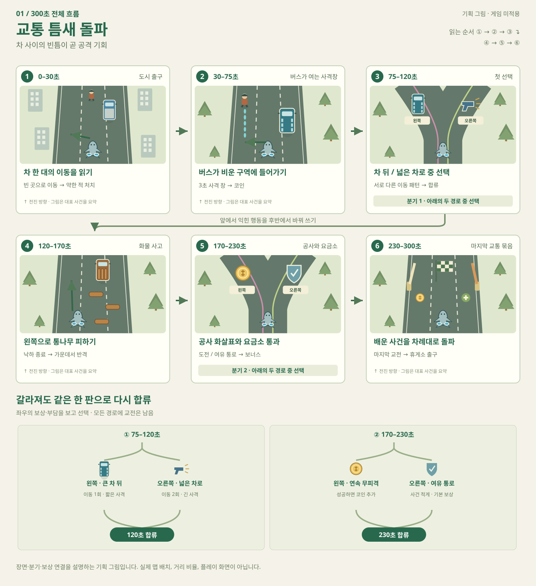
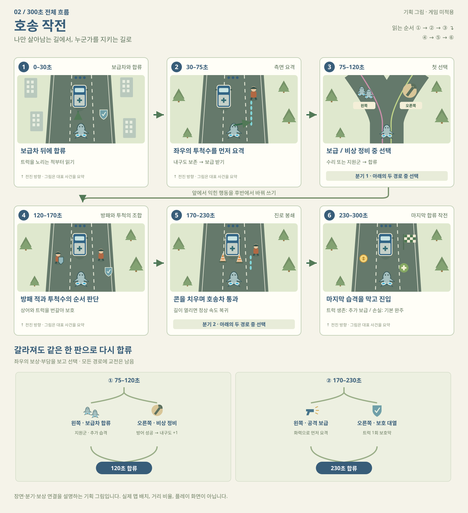
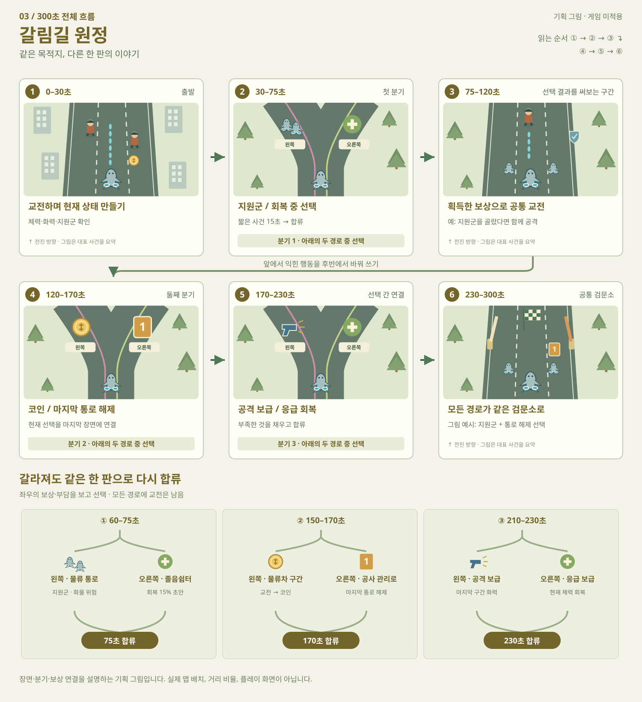
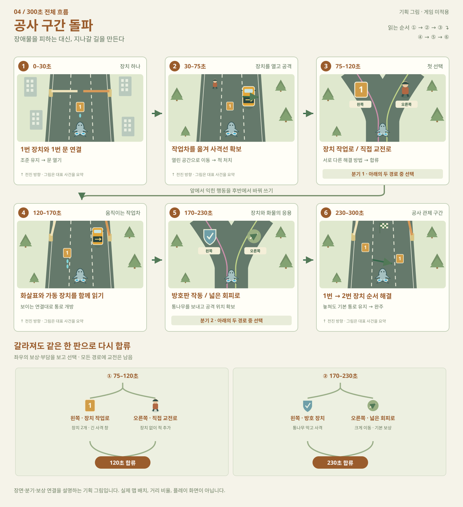
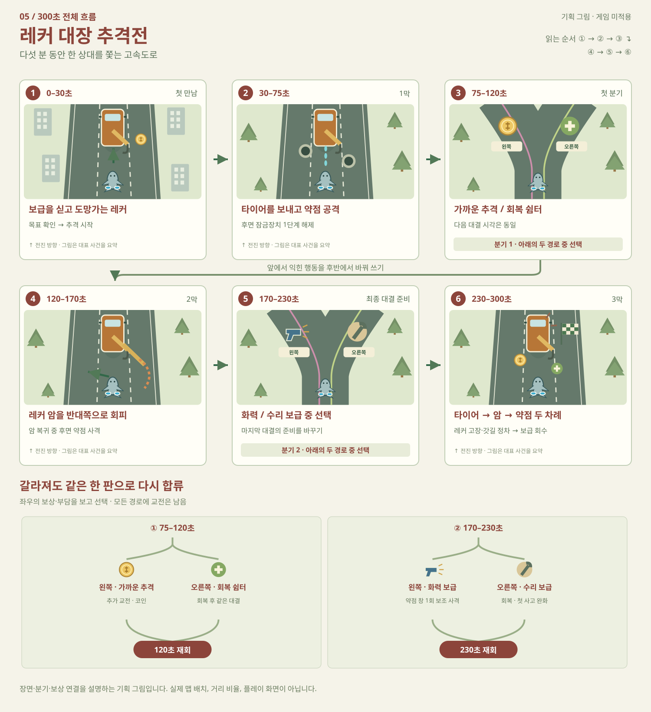

# 고속도로 전면 개편 기획 5안

사용자 요청: 재미 중심으로 상세 기획 5개와 웹페이지. **개발 적용 금지.** 아래 수치·자산 추가·동작은 제안이며 구현·재미·경제 검증 결과가 아니다.

## 근거와 범위

- 현재 자동 전진·좌우 드래그·자동 사격, 곡선 분기, 차량·고라니·통나무·공사·요금소 자산을 확인했다.
- 기존 일반 자동 전투 10회는 초반 접촉 종료. 별도 보정 관찰 2회와 혼합하지 않으며 사람의 승률 근거로 사용하지 않는다.
- 첫 우회로 대형 산 모델 가림과 단순 반복을 출발점으로 삼는다.
- 기획 검토 축: 순간 주행 판단 / 전투 목표 / 경로 선택 / 장치 상호작용 / 기억에 남는 대결.
- 아이디어 생성·비판은 저장소 지침에 따라 메인 스레드에서 순차 수행했다.

## 공통 전제

### 상어로 달리고, 좌우로 판단한다

기존 자동 전진·좌우 드래그·자동 사격을 기본으로 유지한다. 점프·브레이크·조준 버튼은 추가하지 않는다. 도식의 세 구역은 위험을 설명하는 위치이며 캐릭터를 세 칸으로 강제 고정하는 뜻이 아니다.

### 한 판 300초를 설계 기준으로

기존 사용자 요청의 한 판 300초를 기획 기준으로 삼는다. 현재 2,820m 씬의 실측 완주 시간이 300초라는 뜻은 아니다. 20~35초마다 판단을 바꾸고 큰 사건 뒤 6~10초의 회복 호흡을 둔다. 분기 양쪽의 장면 길이를 맞춰 예고 시간과 클리어 시간을 유지한다.

### 위험의 이유가 먼저 보인다

주요 기믹은 약 2.5~3초 전 동작·표지·음향으로 예고하는 초안이다. 한 순간에 해결해야 할 주 위험은 1개, 보조 위험은 최대 1개. 통나무와 정면 교통처럼 안전한 답이 충돌하는 조합은 금지한다.

### 전투는 남기고, 뜻밖의 즉사는 줄인다

각 안에 필수 교전을 남긴다. 다만 적의 잔여 HP와 플레이어 HP를 교환하는 현재 접촉 규칙은 읽기 어렵다. 일반 접촉을 최대 HP 15%와 0.8초 연속 피격 보호로 바꾸는 것은 공통 검토 제안이다. 사용자가 요청한 고라니 20%와 치명적인 도로 파임은 별도 규칙으로 유지하며, 파임은 4초 전부터 보이고 충분히 넓은 회피로를 보장한다. 수치·경제 효과는 미검증이다.

### 회복 우회로에도 장소의 이유를

도로 바깥으로 빠지면 포장된 졸음쉼터·비상 주차대·공사 관리로 중 하나로 읽히게 한다. 숲 내부로 관통하지 않는다. 현재 첫 우회로의 Mountain_Ridge 겹침 해결과 실제 게임 카메라의 시야 검사는 어느 안에서든 선행 조건이다.

### 보상과 제작 범위를 구분

기존 코인·강화·보너스·지원군을 활용하고 새 영구 재화는 만들지 않는다. 이전의 약 30회 도전 성장 목표를 이번 기획으로 폐기하지 않으며, 새 난이도·수익은 별도 검증한다. 프리팹 재사용은 외형 재사용을 뜻한다. 새로운 기믹 동작·리깅·충돌·UI가 이미 구현돼 있다는 뜻은 아니다.

## 추천 순위

1. 교통 틈새 돌파
2. 갈림길 원정
3. 레커 대장 추격전
4. 호송 작전
5. 공사 구간 돌파

순위·확신도는 에이전트의 기획 판단이며 성공 확률이나 사용자 조사 결과가 아니다.

## 1. 교통 틈새 돌파

차를 많이 늘리는 대신, 움직이는 빈 공간을 읽게 만든다. 피한 직후의 안전한 3초가 적을 쓰러뜨리는 시간이다.

**핵심 재미:** 순간 판단 · 주행 숙련  
**판단 질문:** 지금 바로 옮길까, 한 박자 기다렸다가 차 뒤로 들어갈까?  
**제작 부담:** 중간  
**기획 확신도:** 82% (주관적·미검증)  
**상태:** Unexplored / 미적용

**Basis — direct/reasoned:** 현재 차량·고라니·통나무는 개별 사건으로 동작한다. 이를 한 사건의 예고–통과–반격 순서로 묶으면 기존 에셋으로도 ‘똑같은 적 두 명과 보너스’의 반복을 바꿀 수 있다.

**플레이 루프:** 차량의 방향과 빈 구역 확인 → 한 번의 좌우 이동으로 통과 → 열린 사격 구간에서 필수 적 처치 → 무피격 연속 보상 회수

**조작:** 전진 속도는 기본적으로 일정하다. 차들은 플레이어와 다른 상대 속도로 움직이며, 캐릭터는 차 위에 타거나 차량을 조종하지 않는다. 차 옆을 아슬아슬하게 스치는 행위 자체에는 추가 보상을 주지 않는다.

**현재와의 차이:** 차량 생성이 무작위 물량 중심에서 12~18초짜리 주행 묶음 중심으로 바뀐다. 교통과 필수 적이 동시에 도주로를 봉쇄하지 않게 사건 단위로 예약한다.

### 300초 진행

**0–30초 · 도시 출구 / 틈 읽기**

큰 차 한 대가 지나가면 열린 쪽으로 한 번 이동한다. 첫 15초에는 공격 적을 두지 않고, 다음 15초에 1명의 약한 적으로 ‘피하고 쏜다’를 알려준다.

**30–75초 · 버스가 여는 사격창**

버스 1대와 순찰차 1대를 시간차로 배치한다. 3초 안전 창에서 전방 적을 처치하고 첫 코인 줄을 얻는다.

**75–120초 · 첫 선택 / 차 뒤 또는 넓은 차로**

왼쪽은 큰 차 뒤를 따라 한 번 크게 이동하는 경로, 오른쪽은 넓지만 두 번 이동하는 경로다. 두 쪽 모두 짧은 필수 교전 후 120초에 합류한다.

**120–170초 · 화물 사고 / 리듬 바꾸기**

통나무가 굴러오는 동안 정면 차량을 멈춘다. 왼쪽으로 피한 다음 가운데로 돌아와 작업대장을 조준한다. 같은 동작을 무작정 반복하지 않는다.

**170–230초 · 공사와 요금소 / 응용**

화살표 작업차가 미리 열린 방향을 보여준다. 둘째 선택은 무피격 보상을 노리는 긴 패턴과 보통 보상의 넓은 통로. 보너스 획득 뒤 8초 쉬는 구간을 둔다.

**230–300초 · 마지막 교통 묶음 / 종합 시험**

버스 통과 → 열린 차로에서 교전 → 통나무 회피 → 요금소 순서로 배운 사건을 재조합한다. 마지막 15초는 휴게소 표지와 넓은 출구로 마무리한다.

### 기믹 상세

#### 버스 뒤의 3초

- **예고:** 버스 방향지시등과 짧은 경적으로 이동 방향을 약 3초 전에 알린다. 차가 사격선을 가리는 구간에는 새 적을 공격 상태로 만들지 않는다.

- **대응:** 버스가 옮겨간 반대쪽으로 이동한다. 비워진 구역에서 자동 사격으로 정면 적을 공격한다.

- **성공:** 3초 동안 교통이 끊기는 사격 창과 짧은 코인 줄. 무피격 통과 3회마다 기존 코인으로 작은 추가 보상.

- **실패:** 차량 접촉은 최대 HP 15% 제안. 맞았다고 다음 차가 바로 연속 충돌하지 않도록 0.8초 보호와 탈출 폭을 둔다.

- **변형:** 좌→우/우→좌, 버스/박스 트럭, 사격 창 3~4초. 이동 도중 방향을 뒤집지 않는다.

- **재료:** V05 관광버스, V08 박스 트럭, 기존 적

- **신규 동작:** 차량 사건 예약과 사격 창 연동. 버스 외형 재사용만으로 이 동작이 생기지는 않는다.

#### 통나무 한 박자 쉬기

- **예고:** V12 통나무 트럭의 적재물이 흔들리고 3초 뒤 가운데·오른쪽으로 떨어진다. 뒤쪽 차량은 그 전에 정리한다.

- **대응:** 왼쪽 안전 구역으로 이동해 낙하 묶음을 보내고, 마지막 통나무를 본 뒤 가운데로 복귀한다.

- **성공:** 회피 뒤 정비공의 방어가 풀려 4초간 공격 기회. 무피격이면 코인 보상만 추가한다.

- **실패:** 통나무 1묶음의 피해 상한 20% 제안. 회피 쪽에 고라니·포트홀·정면 차량을 겹치지 않는다.

- **변형:** 낙하 2개 또는 3개, 간격만 변화. 안전한 왼쪽이라는 학습 규칙은 유지한다.

- **재료:** V12 통나무 트럭, P15 통나무, LogTruckSpill

- **신규 동작:** 기존 낙하·교통 억제 기반을 재사용하고 피해 중복 방지·반격 창을 연결.

#### 화살표 따라 한 번, 다시 한 번

- **예고:** 작업차 LED는 첫 이동 방향을 고정 표시한다. 첫 구간 통과 후 별도의 작업차가 두 번째 방향을 알린다.

- **대응:** 첫 화살표 쪽으로 이동해 좁은 공사 구간을 지나고, 다음 예고가 뜬 뒤에만 반대쪽으로 이동한다.

- **성공:** 두 번째 구간 뒤 공격 보너스 1개. 한 번에 두 화살표를 외우게 하지 않는다.

- **실패:** 콘 접촉은 현재의 12% 손실을 기본으로 검토. 굳이 차로 전체를 막아 적에게 들이받게 하지 않는다.

- **변형:** 우–좌, 좌–우, 우–우. 서로 다른 색만으로 방향을 설명하지 않는다.

- **재료:** V10 화살표 작업차, C08 신호수, 기존 콘

- **신규 동작:** 두 사건의 순서 제어와 신호수 동작 동기화.

#### 닫히기 전이 아니라 열린 뒤 통과

- **예고:** 요금소의 다음 통로가 먼저 열리고, 기존 통로는 경고 후 닫힌다. 새 통로는 3초 이상 미리 확인 가능하게 한다.

- **대응:** 열린 차단기 쪽에서 적을 쏘며 통과한다. 닫히는 차단기로 무리하게 돌진할 이유를 없앤다.

- **성공:** 구간 통과 직후 회복 또는 공격 보너스 중 하나를 선택한다.

- **실패:** 차단기 접촉 피해는 일반 사고 규칙으로 통일하는 제안. 치명적인 도로 파임과 같은 아이콘을 쓰지 않는다.

- **변형:** 3개 중 열린 통로 위치와 적 역할 변경. 최소 1개 통로는 항상 확보한다.

- **재료:** 기존 요금소·차단기, C09 요금소 직원

- **신규 동작:** GateTargetAngle의 선개방 방식에 사건 예약·보상 타이밍을 연결.

### 분기

- **첫 선택:** 왼쪽 · 큰 차 뒤 — 이동은 1번, 사격 창은 짧음. 버스가 지나간 뒤 나가야 한다. / 오른쪽 · 넓은 차로 — 이동은 2번, 사격 창은 길음. 양쪽 적 총 체력과 기본 보상은 비슷하게 맞춘다.

- **둘째 선택:** 왼쪽 · 연속 무피격 도전 — 12초 안에 세 사건. 성공 시 코인 보상 추가, 실패해도 기본 보상 유지. / 오른쪽 · 여유 통로 — 같은 시간에 두 사건. 추가 코인은 적지만 충분히 회복할 공간을 제공한다.

### 마지막 장면

차를 한꺼번에 쏟지 않고 배웠던 3개 사건을 연속 연결한다. 270초 이후에는 처음 보는 규칙을 추가하지 않는다.

### 기존 모델 재사용

- **재사용 · V05 / V08 / V10 / V12:** 버스·박스 트럭·화살표차·통나무 트럭. 이동과 상태 표시만 추가.

- **재사용 · P15 / P16 / A11:** 통나무·도로 파임·고라니. 동일 화면 동시 사용을 제한.

- **보완 · 요금소·콘·C08 / C09:** 방향·통로·반격 동작의 연결과 접촉 범위 재검수.

### 신규 제작 후보

- **필수 모델 0종:** 현재 모델로 회색 상자 시제품 가능. 차선·상태 표시는 코드·UI로 제작.

- **선택 모델 1종:** 순서를 보여주는 소형 이동식 전광판. 기존 LED 작업차 판을 분리해서도 제작 가능.

### 필요한 시스템

- 교통·적·기믹의 시간표를 함께 관리하는 사건 예약
- 무피격 묶음 판정과 기존 코인 지급
- 예고 시점부터 실제로 비어 있는 회피 폭 검사

### 주의할 점

- 빈틈이 너무 좁으면 시원함 대신 억울함이 된다. 기본 캐릭터 폭 2배 이상을 초기 통로 기준으로 제안한다.
- 배치가 완전히 고정이면 외우기만 한다. 안전 답은 보존하고 차량 종류·방향·공격 대상만 바꾼다.
- 3배속 자동 플레이 수치로 반응 시간을 결정하면 안 된다. 최종 예고 시간은 1배속 손 플레이로 정한다.

### 선택 후 확인할 기준

- 처음 본 사람이 예고와 실제 위험 방향을 설명할 수 있는가
- 피해의 절반 이상이 시야 가림이나 겹친 위험 때문이라면 구성 재검토
- 같은 길을 두 번 지나면 입력 실수는 줄고, 여전히 공격 위치를 판단하는가

**작은 시제품 제안:** 60초짜리 ‘버스 → 반격 → 통나무 → 반격’ 네 장면만 먼저 비교한다. 기획 검토용 범위이며 아직 제작하지 않았다.

## 2. 호송 작전

작은 보급 트럭과 함께 달린다. 내 앞의 코인을 먹을지, 트럭을 겨누는 적을 먼저 쓰러뜨릴지 선택한다.

**핵심 재미:** 우선순위 · 이동 방어  
**판단 질문:** 지금 나를 공격하는 적과 트럭을 공격하는 적 중 누구를 먼저 막을까?  
**제작 부담:** 높음  
**기획 확신도:** 68% (주관적·미검증)  
**상태:** Unexplored / 미적용

**Basis — direct/reasoned:** 보유 차량·순찰대·방패 적·정비공을 역할만 바꿔 활용할 수 있다. 외부 참고의 방어 목표가 주는 공간적 우선순위를, 이 게임에서는 계속 이동하는 트럭과 좌우 위치에 적용하는 추론이다.

**플레이 루프:** 트럭을 노리는 적 확인 → 해당 방향에 서서 자동 사격 → 위험이 끝나면 보급 구역 통과 → 트럭 상태에 따라 다음 경로 선택

**조작:** 상어는 트럭 뒤 12~18m에서 자동 전진한다. 트럭 운전은 하지 않는다. 화면에서 트럭이 상어와 전방 적을 가리지 않도록 한쪽으로 살짝 치우쳐 배치한다.

**현재와의 차이:** 기존 적의 공격 대상을 플레이어 또는 호송차로 명확히 분리한다. 트럭 HP는 ‘내구도 3칸’처럼 간단히 표시한다. 트럭 파괴 시 즉시 게임오버시키지 않고 호송 보너스만 잃고 기본 완주를 계속한다.

### 300초 진행

**0–30초 · 보급차와 합류**

트럭이 전방으로 들어오고 측면 적 1명이 트럭을 겨눈다. 큰 표적선 하나로 지켜야 할 대상을 알려준다.

**30–75초 · 측면 요격**

좌·우 공격대가 번갈아 등장한다. 한쪽을 처리한 뒤 트럭이 떨어뜨리는 기존 회복 보너스를 통과한다.

**75–120초 · 첫 선택 / 수리 또는 보급**

내구도가 낮으면 오른쪽 정비 공간, 충분하면 왼쪽 보급 경로를 선택한다. 정비에도 짧은 방어 전투가 있다.

**120–170초 · 방패와 투척의 조합**

트럭을 조준하는 투척수와 상어 쪽으로 오는 방패 적을 시간차로 배치한다. 두 공격을 동시에 처음 공개하지 않는다.

**170–230초 · 진로 봉쇄**

정비공이 통로에 콘을 놓는다. 길을 여는 동안 트럭은 자동 감속하고, 위험이 끝나면 원래 속도로 복귀한다.

**230–300초 · 마지막 합류 작전**

두 번의 측면 습격을 막고 휴게소 진입로까지 호송한다. 보급차 생존 여부가 엔딩 보상과 짧은 장면을 바꾼다.

### 기믹 상세

#### 트럭을 겨누는 투척수

- **예고:** 적 머리 위 트럭 아이콘과 3초 충전 동작. 지면 위험 표시는 트럭 쪽으로 끝나며 상어 대상 공격과 형태를 다르게 한다.

- **대응:** 그 적 앞쪽 차로로 이동해 자동 사격한다. 트럭 뒤에만 숨어 있으면 공격하지 못하는 배치를 피한다.

- **성공:** 공격을 끊으면 트럭 내구도를 보존하고 다음 보급 주기가 유지된다.

- **실패:** 한 번 놓치면 내구도 1칸. 한 사건에서 같은 투척수가 여러 칸을 연속 빼지 못한다.

- **변형:** 왼쪽 또는 오른쪽 투척수, 앞을 막는 방패 적 1명. 첫 두 번은 방패를 섞지 않는다.

- **재료:** C01 순찰대, 기존 투척 동작, V04 소형 트럭

- **신규 동작:** 공격 대상 구분·트럭 피해 판정·공격 중단 규칙이 새로 필요.

#### 옆으로 비켜 주는 호송차

- **예고:** 트럭 방향지시등이 켜지고 후면에 이동 방향 아이콘이 표시된다. 상어와 같은 위치로 갑자기 겹치지 않는다.

- **대응:** 트럭이 오른쪽으로 가는 동안 왼쪽 사격선에 서서 정면 봉쇄 적을 처리한다.

- **성공:** 트럭이 방해물이 아니라 사격 공간을 여는 동료처럼 느껴진다.

- **실패:** 트럭 자체는 상어에게 충돌 피해를 주지 않는다. 적을 처리하지 못한 결과만 별도 표시한다.

- **변형:** 좌우 위치 교체와 전방 간격 변화만 사용. 화면 전체를 덮는 대형 버스는 호송 주체로 쓰지 않는다.

- **재료:** V04 1톤 트럭, V08 박스 트럭의 보급 적재물

- **신규 동작:** 호송차 전용 위치 추종과 충돌 예외. 일반 교통 AI와 그대로 공유하지 않는다.

#### 6초 긴급 정비

- **예고:** 오른쪽 비상 주차대의 공구 아이콘과 ‘내구도 +1’ 표시를 분기 전에 보여준다.

- **대응:** 정비 차로로 들어간 뒤 6초간 작업자를 노리는 적을 처리한다. 이동 장면을 줄이고 해당 경로의 총 길이는 반대쪽과 맞춘다.

- **성공:** 트럭 내구도 1칸 복구. 플레이어 HP 회복과 구분된 아이콘·문구를 사용한다.

- **실패:** 전투 실패 시 수리 보상만 놓친다. 여기서 트럭 체력을 다시 잃게 하는 이중 벌은 피한다.

- **변형:** 수리 1칸 또는 트럭 일회 보호막 중 선택. 손상이 없으면 수리 대신 소량 코인.

- **재료:** C10 레커 기사, V09 레커차, P01 표지

- **신규 동작:** 분기별 짧은 방어 사건과 수리 상태 연출. 기존 RestStop 장시간 방어전 복제는 하지 않는다.

#### 보급을 먹을까, 먼저 막을까

- **예고:** 보급은 왼쪽, 투척수는 오른쪽에 보인다. 공격은 보급을 지나갈 수 있는 시간을 준 뒤 시작한다.

- **대응:** 우선 적을 막고 합류하면서 보급을 줍거나, 체력이 급하면 회복을 먼저 챙긴다.

- **성공:** 내 상태와 트럭 상태에 따라 정답이 달라진다. 보급은 기존 회복·지원군을 사용한다.

- **실패:** 회복 선택을 ‘트럭에 무조건 피해’로 강제하지 않는다. 숙련자는 둘 다 챙길 수 있는 여유를 둔다.

- **변형:** 보급 종류와 공격 방향 교체. 보급 위로 차량을 덮어씌우지 않는다.

- **재료:** 기존 보너스·지원군, 순찰대

- **신규 동작:** 위험 시각과 보상 시각을 함께 잡는 사건 연출.

### 분기

- **첫 선택:** 왼쪽 · 보급차 합류 — 코인·지원군을 확보하지만 측면 공격이 한 번 더 있다. / 오른쪽 · 비상 정비 — 짧은 방어 성공 시 트럭 내구도 +1. 상어 HP는 별도 관리.

- **둘째 선택:** 왼쪽 · 빠른 호송 대열 — 트럭 보호막 대신 공격 보너스. 마지막 투척수를 빨리 처리해야 한다. / 오른쪽 · 보호 대열 — 트럭 한 번의 피격을 막는 보호막. 코인 보상은 더 적다.

### 마지막 장면

트럭 내구도가 남으면 휴게소에 먼저 들어가 상어를 기다리고 추가 보급을 지급한다. 잃었으면 상어 혼자 빠져나오는 기본 결말. 재도전 동기를 만들되 4분 플레이를 강제로 무효화하지 않는다.

### 기존 모델 재사용

- **재사용 · V04 / V09 / C10:** 소형 호송차·수리차·정비 캐릭터 외형.

- **재사용 · C01 / C07 / C02:** 순찰대·방패 적·도로 직원. 기존 공격 역할을 호송 문맥으로 재배치.

- **보완 · 기존 회복·지원군 보너스:** 보급 투하 위치와 획득 시간을 호송차에 맞게 조정.

### 신규 제작 후보

- **필수 보완 1세트:** 트럭 적재함에 붙이는 보급 상자와 호송 식별판. 기존 V04 바디를 새 차처럼 통째로 만들 필요 없음.

- **필수 UI 1세트:** 내구도 3칸, 공격 대상 아이콘, 수리 표시. 모델 제작 수에 포함하지 않음.

- **선택 모델 1종:** 작은 공구 카트. 기존 레커차 주변 소품으로 대체 가능.

### 필요한 시스템

- 두 대상 공격 AI와 호송차 HP·보상
- 호송차 차로 이동과 플레이어 시야 확보
- 파괴 후에도 정상 진행하는 분기·엔딩

### 주의할 점

- 상어와 트럭을 동시에 관리하면 피곤할 수 있다. 트럭 공격을 10~15초 단위 사건으로 제한한다.
- 호송차가 내 총알과 시야를 막으면 즉시 불쾌해진다. 발사 경로와 겹치지 않는 위치를 먼저 확인한다.
- 보너스를 잃는 것과 실패를 구분하지 못하면 허탈하다. 트럭 손실 후 기본 완주가 가능하다는 안내가 필요하다.

### 선택 후 확인할 기준

- 적이 누구를 노리는지 설명 없이 읽히는가
- 상어가 사격할 수 있는 위치가 항상 남는가
- 트럭을 잃은 뒤에도 계속 달릴 이유와 정상 종료가 남는가

**작은 시제품 제안:** 45초 동안 투척수 2명과 수리 선택 1번만 구성해, 추가 체력바가 긴장인지 부담인지 먼저 평가하는 제안.

## 3. 갈림길 원정

회복 길과 본선을 반복하는 대신, 세 번의 출구 선택으로 이번 판의 부족한 것을 채운다. 현재 체력과 지원군에 따라 고르는 길이 달라진다.

**핵심 재미:** 경로 선택 · 빌드 판단  
**판단 질문:** 지금 나에게 필요한 것은 회복인가, 화력인가, 다음 위협을 피할 정보인가?  
**제작 부담:** 중간~높음  
**기획 확신도:** 78% (주관적·미검증)  
**상태:** Unexplored / 미적용

**Basis — direct/reasoned:** 현재 두 우회로는 같은 규칙이며 일반 전투 10판에서는 첫 우회가 만피 회복으로 끝난 경우도 있었다. 분기 보상을 현재 상태와 연결하고 길의 사건 자체를 바꾸면 선택의 의미를 만들 수 있다.

**플레이 루프:** 표지판에서 다음 두 사건 미리 보기 → 좌우 위치로 선택 확정 → 선택한 사건의 필수 교전 해결 → 보상으로 다음 선택 기준 변화

**조작:** 갈림길 앞에서 게임을 멈추는 지도 메뉴는 띄우지 않는다. 5초 전 표지에 보상·위험 아이콘 2개만 보여주고, 물리적 차로 선택으로 확정한다. 현재 2개 분기를 3개로 늘리는 신규 설계다.

**현재와의 차이:** 맵을 한 길의 장식 교체가 아니라 진입–선택 사건–합류 단위로 다시 구성한다. 세 번의 이진 선택으로 기본 8개 조합이 생기지만, 8개 전체 맵을 별도로 제작하지 않는다.

### 300초 진행

**0–30초 · 출발 / 현재 상태 확인**

기본 교전과 보너스로 이번 판의 체력·화력 상태를 만든다. 첫 분기 전에는 위험 없는 안내 여유를 둔다.

**30–75초 · 첫 분기 / 회복 또는 지원군**

55초에 예고, 60초에 확정. 오른쪽 졸음쉼터는 회복, 왼쪽 물류 통로는 지원군 획득 기회. 두 경로 모두 15초 사건이며 75초에 합류한다.

**75–120초 · 선택 결과를 써보는 구간**

회복을 골랐으면 생존 여유, 지원군을 골랐으면 사격 여유가 체감되는 공통 적 조합을 둔다.

**120–170초 · 둘째 분기 / 장치 해제 또는 자원**

145초 예고, 150초 확정. 공사 관리로에서 마지막 요금소 한 통로를 미리 해제하거나 물류차 구간에서 코인을 얻는다. 170초에 합류한다.

**170–230초 · 선택 간 연결 / 마지막 준비**

현재 지원군과 체력을 보고 세 번째 선택을 준비한다. 205초 예고, 210초 확정. 회복 또는 마지막 교전에만 적용되는 화력 보급을 받고 230초에 합류한다.

**230–300초 · 공통 검문소 / 선택 결산**

모든 경로가 같은 마지막 필수 교전으로 모인다. 둘째 선택에서 얻은 해제 효과와 셋째 보급이 여기서 실제로 작동한다. 어떤 선택도 필수 교전 전체를 건너뛰지 않는다.

### 기믹 상세

#### 보상이 보이는 출구 표지

- **예고:** 분기 5초 전 ‘쉼터: 회복 15% / 짧은 교전’, ‘물류: 지원군 / 화물 위험’처럼 보상과 위험을 함께 보여준다.

- **대응:** 좌우로 이동해 원하는 경로를 고른다. 확정선 전 1초 동안 내 선택 아이콘을 보여주고, 확정 후에는 길이 실제로 분리된다.

- **성공:** 무엇을 얻고 무엇을 포기했는지 알고 선택한다. 현재 만피이면 회복이 낭비된다는 점도 미리 표시한다.

- **실패:** 중앙으로 들어가면 기본 본선. 실수로 선택을 놓쳤다고 벽에 부딪히거나 즉사하지 않는다.

- **변형:** 보상 종류는 표지와 함께 바뀌지만 색·좌우의 의미를 판마다 뒤집지 않는다.

- **재료:** P01 표지, 기존 녹색·분홍 유도선

- **신규 동작:** 분기 예고·상태 적합성 표시·선택 확정 피드백.

#### 진짜 졸음쉼터

- **예고:** 포장된 작은 주차대, 쉼터 표지, 회복 지점이 진입 전에 보인다. 산과 나무는 배경 경계 밖에 둔다.

- **대응:** 짧은 적 1조를 처리한 뒤 초록 회복 지점을 통과한다. 오래 서서 방어하지 않는다.

- **성공:** 최대 HP 15% 회복 초안. 만피일 때는 미리 표기된 소량 코인으로 대체해 완전한 빈 선택을 피한다.

- **실패:** 적을 처리하지 못하면 통상 전투 피해는 있지만 회복 지점 자체는 사라지지 않는다.

- **변형:** 주차대 모양 2종, 적 접근 방향 2종. 식당·상점 내부는 휴게소 챕터에 남긴다.

- **재료:** P01, P12 테이블, V01 소형차, 기존 도로

- **신규 동작:** 15초 전용 경로와 회복 대신 코인 처리. 현재 우회로의 단순 중간 지급을 개편.

#### 물류차의 지원군 상자

- **예고:** 화물차 적재함에 기존 지원군 보너스 문양을 표시한다. 옆에 떨어질 화물 위치도 미리 보인다.

- **대응:** 화물 위험을 피해 상자를 지키는 적을 처리한다. 기존 자동 사격과 보너스 통과 획득을 사용한다.

- **성공:** 기존 지원군 1명 또는 지원군 회복. 이미 상한이면 공격 보너스로 대체한다는 규칙을 표기한다.

- **실패:** 교전 실패 시 기본 코인만 받고 지원군은 놓친다. 길 자체는 합류 가능하다.

- **변형:** 상자의 수를 늘리기보다 적 역할과 화물 낙하 방향을 바꾼다.

- **재료:** V08 박스 트럭, 기존 지원군·보너스 외형

- **신규 동작:** 지원군 상한·대체 보상과 해당 구간의 성공 조건.

#### 지금 열어두는 마지막 통로

- **예고:** 공사 관리로 안내에 ‘마지막 검문소 왼쪽 차단기 해제’와 해당 모양의 아이콘을 함께 보여준다.

- **대응:** 관리 장치를 지키는 적을 처리하고 스위치 구역을 통과한다. 별도 인벤토리 아이템을 만들지 않는다.

- **성공:** 230초 이후 마지막 교전에서 안전한 통로 하나가 더 오래 열린다. 필수 적 처치 자체는 남는다.

- **실패:** 장치를 놓치면 원래 난이도의 검문소. 불가능한 상태나 완주 불가로 이어지지 않는다.

- **변형:** 다음에 해제할 통로 위치만 바꾼다. 보스 HP 감소 같은 숨은 효과는 넣지 않는다.

- **재료:** V10, C02, 기존 차단기

- **신규 동작:** 현재 선택의 결과를 마지막 사건에 전달하는 한 판 상태.

### 분기

- **60초 선택:** 왼쪽 · 물류 통로 — 지원군 기회 / 화물 회피와 짧은 필수 교전. / 오른쪽 · 졸음쉼터 — 회복 15% 초안 / 약한 필수 교전. 만피 대체 보상 사전 표기.

- **150초 선택:** 왼쪽 · 물류차 구간 — 기존 코인 보상 / 교전 부담 증가. / 오른쪽 · 공사 관리로 — 마지막 차단기 한 통로 해제 / 장치 확보 교전.

- **210초 선택:** 왼쪽 · 공격 보급 — 마지막 구간 동안만 공격력 +15% 초안. 영구 강화 아님. / 오른쪽 · 응급 보급 — 현재 상태 회복. 둘 다 230초에 같은 검문소로 합류.

### 마지막 장면

초반 선택을 마지막 구간에서 다시 떠올릴 수 있게 한다. ‘관리로에서 열어둔 왼쪽 통로’가 보이고, 지원군이 공격하며, 마지막 보급의 지속 범위가 명확히 끝난다.

### 기존 모델 재사용

- **재사용 · HighwayRoute의 분리·합류 구조:** 현재 좌우 경로 계산을 출발점으로 삼되 세 분기와 사건 상태는 추가 작업.

- **재사용 · V08 / V10 / P01 / P12:** 물류 통로·관리로·쉼터의 외형 구성.

- **재사용 · 기존 지원군·코인·회복 보너스:** 새 영구 재화 없이 획득 내용의 차이를 만듦.

### 신규 제작 후보

- **필수 보완 2세트:** 졸음쉼터 포장 모듈, 공사 관리 장치. 도로·표지·차단기 조합으로 제작 가능.

- **필수 UI 1세트:** 두 선택의 보상·위험을 담는 표지 그래픽.

- **선택 모델 1종:** 작은 공사 관리 부스. 휴게소 건물 내부를 대규모로 복제하지 않음.

### 필요한 시스템

- 3개 분기 사건과 선택 이력
- 보상 상한·만피 대체 보상·최종 구간 효과
- 분기 두 경로의 진행 시간과 교전 밀도 맞추기

### 주의할 점

- 회복만 계속 고르는 답이 생길 수 있다. 지원군·통로 해제가 이후 부담을 얼마나 줄이는지 함께 비교한다.
- 분기 콘텐츠가 장식만 달라지면 전면 개편 효과가 약하다. 각 분기에 최소 하나의 다른 행동이 필요하다.
- 지원군 획득과 코인 차이가 약 30회 성장 목표를 흔들 수 있다. 이번 기획 수치로 경제가 검증됐다고 보지 않는다.

### 선택 후 확인할 기준

- 상태 세 가지에 대해 항상 같은 경로만 우월하지 않은가
- 선택 결과를 다음 장면에서 식별할 수 있는가
- 어느 경로도 필수 교전을 전부 우회하거나 완주를 막지 않는가

**작은 시제품 제안:** 두 경로 20초씩과 공통 합류전 20초만 비교한다. 만피·저체력·지원군 없음 세 상태에서 선택이 바뀌는지 보는 설계 검증을 제안한다.

## 4. 공사 구간 돌파

색깔 벽을 외우는 퍼즐이 아니라, 장치가 어떻게 길을 여는지 보는 짧은 판단이다. 멈추지 않고 쏘면서 해결한다.

**핵심 재미:** 관찰 · 사격 퍼즐  
**판단 질문:** 저 적을 먼저 쏠까, 옆의 장치를 쏴서 안전한 통로를 열까?  
**제작 부담:** 높음  
**기획 확신도:** 64% (주관적·미검증)  
**상태:** Unexplored / 미적용

**Basis — direct/reasoned:** 화살표차·신호수·차단기·작업자가 이미 있다. 단순 장애물 배치를 길을 여는 인과관계로 묶을 여지가 있다. 예고된 위협에 대응한다는 외부 디자인 원리를 실시간 자동 사격에 맞춰 해석한 제안이다.

**플레이 루프:** 앞의 닫힌 길과 연결 장치 확인 → 장치 앞 차로로 이동 → 자동 사격으로 장치 작동 → 열린 길로 통과하며 적 처치

**조작:** 카메라와 좌우 조작은 유지한다. 장치는 사거리 안에서 정면에 설 때 자동 사격으로 작동한다. 퍼즐 장치의 필요 타격은 무기 속도 차이에 덜 민감하게 ‘조준 유지 1.2초’로 판정하는 초안을 제안한다.

**현재와의 차이:** 자동 사격 우선순위와 장치-통로 연결이 새로 필요하다. 장치 실패로 벽 앞에 갇히지 않도록 기본 통로 하나를 남긴다. 도로 전체를 봉쇄하는 강제 정답 문제는 제외한다.

### 300초 진행

**0–30초 · 장치 하나 / 결과 하나**

번호 1 장치를 쏘면 같은 번호 차단기가 열린다. 적과 차량은 처음 장치 학습을 방해하지 않는다.

**30–75초 · 장치를 열고 공격**

가운데 장치를 작동시키면 오른쪽의 짧은 사격 구역이 열린다. 열린 공간에서 적을 처리한다.

**75–120초 · 첫 선택 / 작업로 또는 교전로**

왼쪽은 장치 두 번으로 보너스 통로를 열고, 오른쪽은 장치 없이 적을 더 상대한다. 둘 다 필수 교전이 남는다.

**120–170초 · 움직이는 작업차**

LED 작업차가 고정한 다음 경로를 읽고 옆 장치를 작동한다. 정답을 본 뒤 몰래 바꾸는 패턴은 쓰지 않는다.

**170–230초 · 장치와 화물의 응용**

장치를 켜면 통나무 방지턱이 세워져 안전한 길을 확보한다. 무작위 교통과 동시에 나오지 않는다.

**230–300초 · 공사 관제 구간**

배운 장치 두 개를 순서대로 사용하며 필수 적을 쓰러뜨린다. 마지막은 장치 실패 시에도 열리는 기본 통로와 보상 통로를 분리한다.

### 기믹 상세

#### 번호가 연결된 차단기

- **예고:** 장치와 차단기에 같은 큰 번호·도형을 붙이고 얇은 연결 표시를 보여준다. 색만으로 대응을 요구하지 않는다.

- **대응:** 장치 앞쪽에 서서 1.2초 동안 조준을 유지한다. 자동 사격 이펙트가 충전 진행을 보여준다.

- **성공:** 해당 통로가 6초 동안 열린다. 남은 시간은 작은 게이지로 보여준다.

- **실패:** 놓치면 기본 통로로 돌아간다. 보너스만 포기하며 즉사나 진행 정지는 없다.

- **변형:** 장치 위치와 열린 통로 위치를 바꾸되 화면에 연결 관계를 계속 남긴다.

- **재료:** 기존 차단기, C08 신호수

- **신규 동작:** 장치 타깃 우선순위·연결 상태·조준 유지 판정.

#### 작업차를 가동해 시야 확보

- **예고:** 앞을 일부 가린 작업차와 옆의 가동 장치가 동시에 보인다. 작업차 뒤 적은 가려진 동안 공격하지 않는다.

- **대응:** 장치를 쏘면 작업차가 옆으로 빠지고 열린 사격선으로 이동한다.

- **성공:** 가렸던 적을 먼저 공격할 수 있는 4초 창. 가림을 불쾌한 사고가 아니라 내 행동의 결과로 바꾼다.

- **실패:** 장치를 놓치면 작업차는 기본 시간표대로 이동한다. 보너스 사격 창이 짧아질 뿐 길은 열린다.

- **변형:** 오른쪽 또는 왼쪽으로 빠지는 작업차. 가동 후 플레이어 쪽으로 갑자기 돌진하지 않는다.

- **재료:** V10 화살표차, C02 도로 직원

- **신규 동작:** 가동 장치와 차량 연출 연결, 뒤 적의 공격 대기.

#### 통나무를 막는 방호판

- **예고:** 전방 적재물이 흔들리고 한쪽 방호판이 접혀 있다. 장치 번호로 어느 구역을 보호하는지 미리 알린다.

- **대응:** 장치를 작동시켜 방호판을 세우거나 기존 왼쪽 회피로를 사용한다.

- **성공:** 방호판 뒤 사격 위치를 유지하면 적에게 더 많은 공격을 넣을 수 있다.

- **실패:** 미작동이어도 왼쪽은 항상 안전하다. 준비 실패가 즉사로 연결되지 않는다.

- **변형:** 방호판 위치 또는 통나무 간격 변경. 방호판 작동 시간을 무기 강화에 의존시키지 않는다.

- **재료:** P15 통나무, V12 트럭

- **신규 동작:** 신규 가동 방호판과 통나무 정지·정리 연출.

#### 두 장치, 한 번에 하나씩

- **예고:** 첫 장치 작동 뒤에만 두 번째 번호를 표시한다. 미래의 모든 표식을 동시에 쏟지 않는다.

- **대응:** 1번을 쏴 통로를 열고 이동한 다음 2번을 쏴 마지막 보너스 공간을 연다.

- **성공:** 추가 코인과 지원군 보너스. 해결 흐름이 ‘쏜다 → 길이 열린다 → 이동한다’로 보인다.

- **실패:** 두 번째를 놓쳐도 기본 완주 경로는 유지. 첫 장치를 다시 쏘도록 되돌리지 않는다.

- **변형:** 두 장치의 순서만 바꾼 3종. 세 개 이상 장기 기억 과제는 기본 난이도에서 제외한다.

- **재료:** 같은 장치·차단기 모듈 재사용

- **신규 동작:** 짧은 퍼즐 상태 진행과 실패 시 정상 합류.

### 분기

- **첫 선택:** 왼쪽 · 작업로 — 장치 2개, 보너스 통로. 관찰을 잘하면 교전 사격 창이 길다. / 오른쪽 · 교전로 — 장치 없음, 필수 적 1조 추가. 복잡한 조작을 원치 않을 때 선택.

- **둘째 선택:** 왼쪽 · 방호 장치 — 장치를 켜서 통나무 구간 사격 위치를 확보. / 오른쪽 · 넓은 회피로 — 장치 없이 크게 회피. 보너스는 적지만 같은 시각에 합류.

### 마지막 장면

거대한 새 보스 대신 관제 장치 2개와 작업대장 교전을 묶는다. 퍼즐을 푼 사람은 유리한 사격 공간을 얻고, 못 푼 사람도 손해를 감수하며 정상 완주할 수 있다.

### 기존 모델 재사용

- **재사용 · V10 / C08 / C02 / C09:** 작업차·신호수·작업자·요금소 직원.

- **재사용 · 기존 차단기·콘·도로:** 장치와 연결할 움직이는 장애물과 통로.

- **재사용 · P15 / V12:** 통나무 기믹의 위험 부분.

### 신규 제작 후보

- **필수 모델 2종:** 번호 패널 장치, 접이식 방호판. 단순 형태여도 실제 움직일 축과 충돌이 맞아야 함.

- **필수 UI 1세트:** 번호 연결, 충전, 열린 시간 표시.

- **선택 모델 1종:** 공사 관제 부스. 보스급 거대 구조물은 제외.

### 필요한 시스템

- 기존 적·장치 사이 자동 사격 타깃 우선순위
- 조준 유지형 장치와 짧은 퍼즐 상태 진행
- 차단기·차량·통나무를 묶는 연동과 실패 우회

### 주의할 점

- 달리는 슈터에서 사고 시간이 너무 길면 속도감이 끊긴다. 화면당 관계는 장치 하나–통로 하나부터 시작한다.
- 총알이 적에게 새서 장치가 안 켜지면 억울하다. 장치 구간에서는 조준 대상을 명시적으로 보여줘야 한다.
- 매번 장치를 쏘느라 전투가 사라질 수 있다. 전체 300초 중 장치 판단 구간은 약 60~90초 수준으로 제한하는 초안이다.

### 선택 후 확인할 기준

- 색을 보지 않아도 어떤 장치가 어떤 통로를 여는지 이해되는가
- 무기·공격속도가 달라도 작동 가능한 시간이 보장되는가
- 정답을 놓쳐도 막힘 없이 기본 경로로 합류하는가

**작은 시제품 제안:** 번호 차단기 한 쌍과 방호판 한 개를 45초 구간에 두는 기획 시제품을 제안한다. 장치가 설명 없이 읽히지 않으면 전체안의 우선순위를 낮춘다.

## 5. 레커 대장 추격전

도망가는 레커 대장이 길을 방해한다. 처음에는 당했던 패턴을 마지막에는 읽고 역으로 공격하는 3막 추격전이다.

**핵심 재미:** 추격 서사 · 보스 패턴  
**판단 질문:** 이번에는 어느 공격을 버티고, 언제 열리는 약점을 노릴까?  
**제작 부담:** 중간~높음  
**기획 확신도:** 73% (주관적·미검증)  
**상태:** Unexplored / 미적용

**Basis — direct/reasoned:** V09 레커차와 C10 기사, 기존 타이어·트럭·공사 소품이 있어 새 거대 괴물을 만들지 않고도 고속도로의 주인공 사건을 만들 수 있다. 다만 차량 약점·보스 상태·연속 연출은 새 기능이다.

**플레이 루프:** 레커 대장의 다음 행동 읽기 → 화물·갈고리 구역 회피 → 노출된 후면 장치를 자동 사격 → 다음 지형에서 달라진 패턴 상대

**조작:** 상어는 계속 달리고 레커차를 직접 운전하지 않는다. 레커차가 너무 멀어 공격 불가능한 상태로 도망가지 않게 장면별 상대 거리를 제어한다. 화면 중앙을 차체로 꽉 막지 않는다.

**현재와의 차이:** 50명의 비슷한 적 반복 중 일부를 추격 보조 적으로 바꾼다. 레커 대장과의 세 차례 대결이 300초의 이유가 된다. 이야기 영상으로 길게 멈추지 않고 2~3초 행동 연출로 연결한다.

### 300초 진행

**0–30초 · 첫 만남**

레커차가 훔쳐 간 보급을 싣고 앞으로 끼어든다. 타이어 하나를 굴리고 멀어진다. 새 목표는 후면 보급 표시로 전달한다.

**30–75초 · 1막 / 타이어 읽기**

좌·우 교대로 굴러오는 타이어와 1조의 보조 적. 첫 후면 약점을 두 번 노려 장갑 한 단계를 해제한다.

**75–120초 · 첫 분기 / 추격 위치 선택**

왼쪽은 가까운 추격과 추가 코인, 오른쪽은 쉼터에서 회복 후 재합류. 어느 쪽이든 보스는 다음 대결 지점에서 기다린다.

**120–170초 · 2막 / 레커 암과 화물**

레커 암이 한쪽 구역을 예고한 뒤 훑는다. 첫 회는 다른 위험 없이 보여준다. 회피 뒤 후면 장치가 열린다.

**170–230초 · 최종 대결 준비**

짧은 일반 교전과 두 번째 보급 선택. 대형 화물차가 빠져나가면 넓은 요금소 접근로가 마지막 무대가 된다.

**230–300초 · 3막 / 배운 패턴의 결산**

타이어 → 암 휘두르기 → 약점 노출을 두 차례 반복한다. 처리 성공 시 레커차가 갓길로 빠지고 보급을 떨어뜨린다. 마지막 10초는 출구 연출을 위해 비운다.

### 기믹 상세

#### 번호를 세는 타이어

- **예고:** 적재함에서 타이어 1개가 들리고 내려올 구역이 3초 먼저 표시된다. 도로에 내놓는 위치와 경고가 일치해야 한다.

- **대응:** 반대쪽으로 한 번 이동한다. 다음 타이어는 첫 것이 통과한 뒤 별도 예고를 시작한다.

- **성공:** 마지막 타이어 뒤 후면 잠금장치가 4초 열린다.

- **실패:** 타이어 접촉은 최대 HP 15% 제안. 같은 타이어가 여러 번 맞히지 않는다.

- **변형:** 초반 1개, 중반 2개, 마지막 2개+보조 적 1명. 낙하 수만 무한히 늘리지 않는다.

- **재료:** V09 레커차, 기존 굴러오는 타이어

- **신규 동작:** 레커 대장 상태와 타이어 방출·약점 시간표.

#### 한쪽을 훑는 레커 암

- **예고:** 암이 회전할 방향으로 천천히 들리고 위험 구역에 넓은 호를 그린다. 소리와 방향 표시를 함께 사용한다.

- **대응:** 반대쪽 안전 구역으로 이동한다. 공격 중에는 반대 방향에서 차량이 오지 않는다.

- **성공:** 암을 되돌리는 동안 후면 발전기 약점이 드러나 자동 사격을 집중한다.

- **실패:** 피격은 최대 HP 20% 제안. 끌어당김·입력 반전·카메라 흔들기를 동시에 넣지 않는다.

- **변형:** 좌·우 방향과 복귀 속도만 변화. 처음부터 양쪽 전체를 쓸지 않는다.

- **재료:** V09 외형을 바탕으로 한 레커 암

- **신규 동작:** 현재 메시의 암 분리 여부 검수. 별도 가동 암·회전축·공격 범위 제작이 필요할 수 있음.

#### 장갑을 벗기는 후면 장치

- **예고:** 평소에는 닫혀 있고 회피 성공 시점에 문이 열리며 명확한 약점 아이콘이 보인다. 유효 타격과 무효 타격을 다른 소리로 전달한다.

- **대응:** 약점 앞쪽 차로에 위치해 자동 사격을 유지한다. 상어를 후진시키거나 점프하게 만들지 않는다.

- **성공:** 첫 대결은 잠금장치, 두 번째는 장갑, 마지막은 동력부를 손상시켜 외형이 단계별로 바뀐다.

- **실패:** 한 번 창을 놓쳐도 다음 창에서 만회 가능. 최저 예상 화력으로도 정해진 창 안에 처리 가능한지를 먼저 계산한다.

- **변형:** 서로 다른 위치의 약점 두 개를 한 번에 하나씩 연다. 무기 변경을 필수 열쇠로 만들지 않는다.

- **재료:** V09 / C10, 기존 명중 효과

- **신규 동작:** 약점 상태·차량 HP·부분 파손 외형. 기존 자동차를 그대로 두고 HP만 늘리는 안은 제외.

#### 추격을 버리지 않는 쉼터

- **예고:** 회복 출구는 레커차가 다음 요금소로 향한다는 장면과 함께 보인다. ‘회복하면 보스를 놓친다’는 거짓 시간 압박을 주지 않는다.

- **대응:** 체력이 부족하면 오른쪽 쉼터, 자신 있으면 왼쪽 가까운 추격로로 들어간다.

- **성공:** 쉼터는 회복, 추격로는 기존 코인과 다음 약점 창에 한 번 적용되는 보조 사격. 두 경로 모두 같은 시각에 보스를 다시 만난다.

- **실패:** 회복 선택 때문에 보스가 자동 도주하거나 보스전이 불가능해지지 않는다.

- **변형:** 회복과 보조 사격의 가치만 조절. 새로운 영구 추격 재화는 만들지 않는다.

- **재료:** 기존 곡선 분기·쉼터 표지·지원군 효과

- **신규 동작:** 분기 이후 보스 상대 거리와 보상 효과 복원.

### 분기

- **첫 선택:** 왼쪽 · 가까운 추격 — 추가 짧은 전투와 코인. 다음 대결 시작 위치가 조금 더 가까움. / 오른쪽 · 회복 쉼터 — HP 15% 회복 초안. 다음 대결 시각은 동일.

- **둘째 선택:** 왼쪽 · 화력 보급 — 마지막 약점 창 한 번에 보조 사격 제공. 회복 없음. / 오른쪽 · 수리 보급 — HP 회복과 첫 사고 1회 피해 완화. 직접 공격해야 보스 장갑이 벗겨짐.

### 마지막 장면

레커차가 폭발로 화면 전체를 가리는 대신 후면 장치가 멈추고 갓길에 정차한다. 탈취 보급이 기존 코인·보너스로 떨어지고 다음 휴게소 입구가 열린다. 새로운 거대 캐릭터를 만드는 비용을 차량 동작에 집중한다.

### 기존 모델 재사용

- **재사용 · V09 / C10:** 레커차와 기사 캐릭터. 외형을 보스 테마로 보완.

- **재사용 · 기존 타이어·V08·V12:** 방해물과 보조 차량. 한 사건에서 사용 수를 제한.

- **재사용 · 기존 요금소·P01·분기:** 세 번째 대결과 회복 경로의 무대.

### 신규 제작 후보

- **필수 보완 1세트:** V09의 가동 암·후면 약점·파손 3단계. 새 모델 한 개보다 리깅·동작 검수가 큰 작업.

- **필수 동작 4개:** 타이어 투하, 암 예고, 암 휘두르기, 고장·정차. 기존 기사 리그 활용 가능성은 별도 검수.

- **선택 모델 1종:** 탈취 보급 상자. 기존 상자·보너스 묶음으로 대체 가능.

### 필요한 시스템

- 3막 보스 상태와 상대 거리 유지
- 약점 창·최저 화력 기준·다음 창 만회 규칙
- 분기 복귀와 보스 상태 연속성·최종 보상

### 주의할 점

- 멋진 연출만 있고 조작은 똑같을 수 있다. 각 막의 안전한 위치와 공격 위치가 다르게 연결돼야 한다.
- 보스 HP를 높여 시간이 길어지는 설계는 피한다. 창을 읽는 실력과 누적 강화의 기여를 따로 검증한다.
- 차체와 암이 시야를 덮을 수 있다. 전방 12~18m 가독성과 휴대폰 화면의 안전 구역부터 확인한다.

### 선택 후 확인할 기준

- 첫 실패 뒤 두 번째 시도에서 패턴 이해로 개선되는가
- 약점 창을 놓친 이유가 시야·타깃 혼동이 아닌 위치 판단인가
- 최저 예상 화력의 정상 플레이로 시간 내 처리 가능한가

**작은 시제품 제안:** 타이어 1회 → 후면 약점 4초 → 암 공격 1회 → 약점 4초의 40초 루프만 비교하는 제안. 연출 없이도 재미가 남는지 먼저 본다.

## 조합과 우선순위

현재 자산·좌우 조작을 가장 잘 살리면서 매 순간의 행동을 바꾼다. 무엇이 재미있어졌는지 60초만으로 확인하기도 쉽다.

반복 플레이와 성장 선택을 더 중요하게 보면 3안, 한 번 플레이한 뒤 기억할 장면이 필요하면 5안이 더 맞다.

혼합한다면 1안을 주축으로 잡고 3안의 ‘회복 또는 지원군’ 분기 한 종류만 먼저 차용한다. 호송 체력·퍼즐 장치·보스 상태를 처음부터 모두 합치면 읽어야 할 정보와 제작 범위가 지나치게 커진다.

## 제외한 방향

| 후보 | 제외 이유 |
|---|---|
| 날씨·야간만 바꾸기 | 풍경 변화는 있지만 플레이어의 판단은 거의 그대로여서 독립 전면 개편안으로 제외. |
| 차량·적 물량만 두 배 | 기존 시야·접촉 사망 문제를 확대하고 재미의 종류가 바뀌지 않음. |
| 운전·점프·브레이크 게임으로 전환 | 상어의 좌우 슈터 조작을 크게 바꾸며 현재 자산·게임 정체성과 멀어짐. |
| 탱크·헬기·거대 괴수전 | 신규 제작과 시야·성능 부담이 큰 데 비해 레커 보스보다 고속도로 맥락이 약함. |
| 완전 무작위 도로 생성 | 안전 경로·합류·보상 경제를 검증하기 어려워 이번 5안의 기반으로 채택하지 않음. |
| 휴게소 식당 방어전 복제 | 이전 사용자 요청의 두 챕터 차별화와 충돌. 짧은 비상 정비 외 장시간 정지 방어는 제외. |

## 참고

- [기존 10판 분석서](http://127.0.0.1:8775/): 일반 자동 전투 10회와 보정된 경로 관찰 2회. 10회 모두 초반 적 접촉 종료였으며 사람의 난이도 통계로 사용하지 않았다.
- [Into the Breach · 공식 소개](https://subsetgames.com/itb.html): 위협을 먼저 보여주고 대응하게 한다는 원리 참고. 턴제 전투 자체나 성공 확률을 이 게임에 그대로 적용한 것이 아니다.
- [Bad North · 공식 소개](https://www.badnorth.com/): 지켜야 할 대상과 공간의 형태가 우선순위를 만든다는 참고. 호송차·보상·시간 수치는 이 기획의 제안이다.
