# 고속도로 개편 5안 — 쉬운 그림 설명

기획 그림입니다. 게임에는 적용하지 않았습니다.

[홈페이지에서 보기](http://127.0.0.1:8776/)

## 1. 차 피하고 쏘기

차를 피한 자리에서 적을 쏴요.

### 1. 차가 길을 막아요

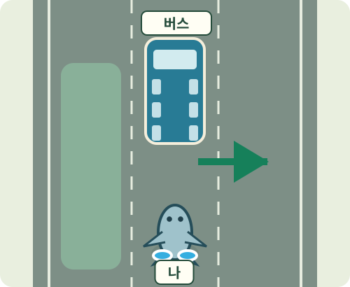

버스가 오른쪽으로 움직입니다.

### 2. 나는 왼쪽으로 피해요

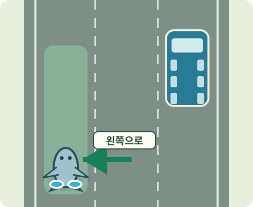

차가 없는 쪽으로 옮깁니다.

### 3. 빈자리에서 적을 쏴요

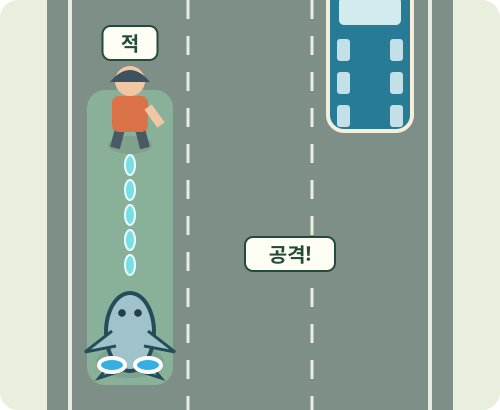

잠깐 열린 틈이 공격 기회입니다.

**재미있는 점:** 피하기에 성공하면 바로 공격할 기회가 생겨요.

**한 판의 흐름:** 차 한 대 피하기 → 첫 갈림길 → 통나무·공사 구간 → 두 번째 갈림길 → 출구 통과

**갈림길의 한 가지 예**

- 왼쪽 · 큰 차 뒤로: 한 번 크게 이동해요. 공격할 시간은 짧아요.
- 오른쪽 · 넓은 차로로: 두 번 움직여요. 공격할 시간은 더 길어요.

**실수하면:** 차에 닿으면 체력을 잃어요. 바로 다음 차까지 연속으로 맞지는 않게 설계해요.

**재사용:** 버스, 트럭, 통나무, 요금소를 다시 쓸 수 있어요.

**새 작업:** 차가 지나간 뒤 공격 시간이 열리도록 새로 연결해야 해요.

## 2. 트럭 지키기

앞서가는 보급 트럭을 지켜요.

### 1. 적이 트럭을 노려요

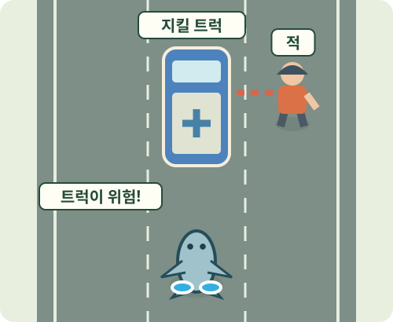

오른쪽 적이 보급차를 공격하려 합니다.

### 2. 그 적부터 쏴요

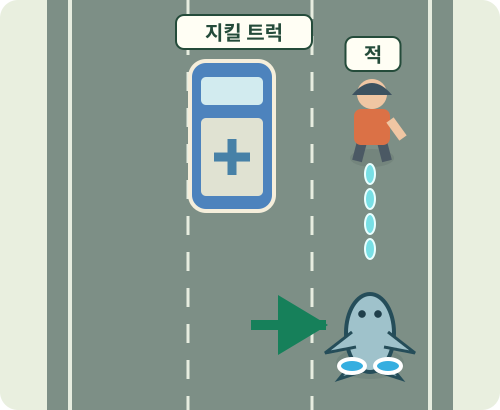

오른쪽으로 옮겨 공격을 막습니다.

### 3. 지키면 보급을 받아요

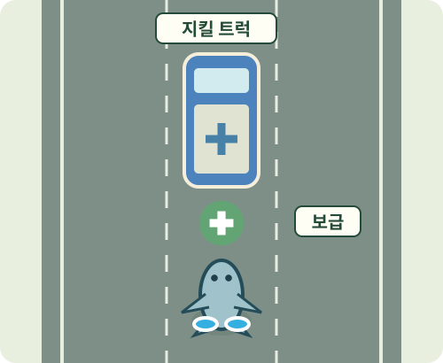

트럭이 회복 아이템을 남깁니다.

**재미있는 점:** 무엇을 먼저 지킬지 고르는 재미가 생겨요.

**한 판의 흐름:** 트럭과 합류 → 첫 습격 막기 → 보급·수리 선택 → 마지막 습격 → 함께 도착

**갈림길의 한 가지 예**

- 왼쪽 · 보급을 더 얻기: 도와줄 동료를 얻을 기회가 있어요. 적도 더 만나요.
- 오른쪽 · 트럭 수리하기: 짧은 전투를 버티면 트럭을 고칠 수 있어요.

**실수하면:** 트럭을 잃어도 내가 살아 있으면 계속 달려요. 호송 보너스만 놓칩니다.

**재사용:** 작은 트럭, 레커차, 경찰·작업자 모델을 다시 쓸 수 있어요.

**새 작업:** 적이 트럭을 노리는 동작과 트럭 수리 기능이 필요해요.

## 3. 갈림길 고르기

지금 필요한 보상이 있는 길을 골라요.

### 1. 두 길의 보상을 봐요

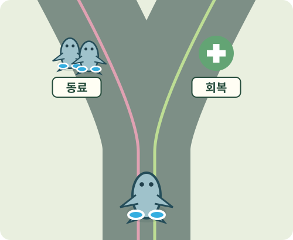

왼쪽은 동료, 오른쪽은 체력 회복입니다.

### 2. 아프니까 오른쪽으로

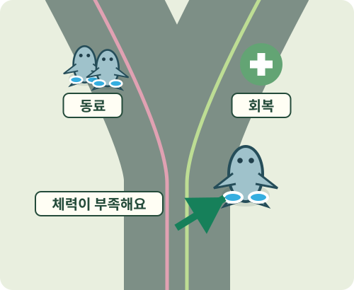

이번에는 회복이 필요한 상황입니다.

### 3. 회복하고 다시 합류해요

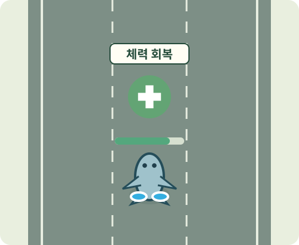

짧은 전투 뒤 회복하고 큰길로 돌아옵니다.

**재미있는 점:** 내 상태에 따라 좋은 선택이 달라져요.

**한 판의 흐름:** 첫 전투 → 동료 또는 회복 → 돈 또는 통로 열기 → 화력 또는 회복 → 마지막 검문소

**갈림길의 한 가지 예**

- 왼쪽 · 동료 데려오기: 적을 잡으면 함께 싸울 동료를 얻어요.
- 오른쪽 · 체력 회복하기: 짧은 전투 뒤 체력을 채워요.

**실수하면:** 어느 쪽을 골라도 큰길로 돌아와요. 다만 고르지 않은 쪽의 보상은 받지 못해요.

**재사용:** 현재 갈림길, 쉼터 표지, 회복·지원군 보너스를 쓸 수 있어요.

**새 작업:** 선택한 보상이 다음 구간에도 이어지도록 만들어야 해요.

## 4. 문 열고 지나가기

앞의 장치를 쏘면 길이 열려요.

### 1. 앞의 문이 닫혔어요

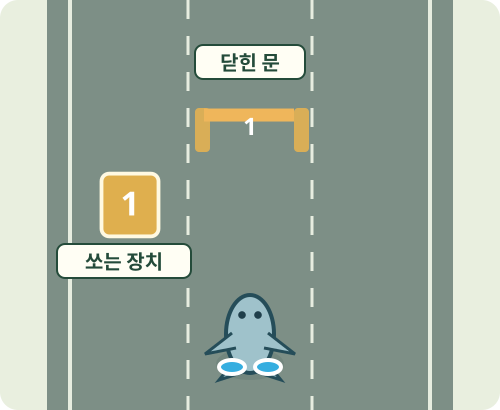

옆 장치에 같은 번호가 붙어 있습니다.

### 2. 장치를 향해 쏴요

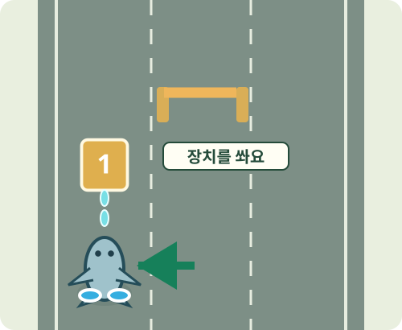

장치 앞에 서면 자동으로 공격합니다.

### 3. 열린 문으로 지나가요

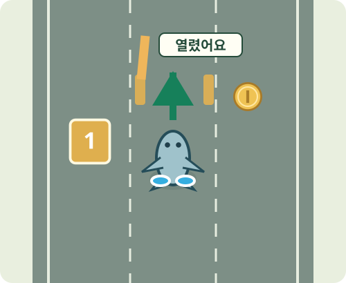

새로 열린 길에서 적과 보상을 만납니다.

**재미있는 점:** 내가 쏜 결과로 길이 바뀌는 게 보여요.

**한 판의 흐름:** 장치 하나 익히기 → 첫 갈림길 → 작업차·통나무 → 두 번째 갈림길 → 문 두 개 통과

**갈림길의 한 가지 예**

- 왼쪽 · 장치를 쓰는 길: 장치를 작동시키면 공격하기 좋은 자리가 열려요.
- 오른쪽 · 바로 싸우는 길: 장치는 없지만 적을 더 상대해야 해요.

**실수하면:** 장치를 놓쳐도 옆의 기본 통로로 지나가요. 길 앞에 갇히게 만들지는 않아요.

**재사용:** 차단기, 화살표 작업차, 공사 소품을 다시 쓸 수 있어요.

**새 작업:** 쏘면 작동하는 장치와 장치에 연결된 문이 필요해요.

## 5. 레커차 추격하기

레커차의 큰 공격을 피하고 약점을 쏴요.

### 1. 레커가 오른쪽을 공격해요

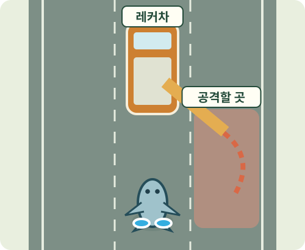

팔을 들고 공격할 방향을 미리 보여줍니다.

### 2. 나는 왼쪽으로 피해요

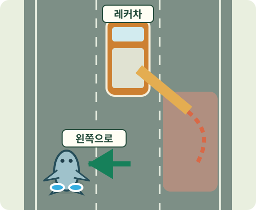

큰 공격이 지나갈 때까지 기다립니다.

### 3. 뒤에 열린 약점을 쏴요

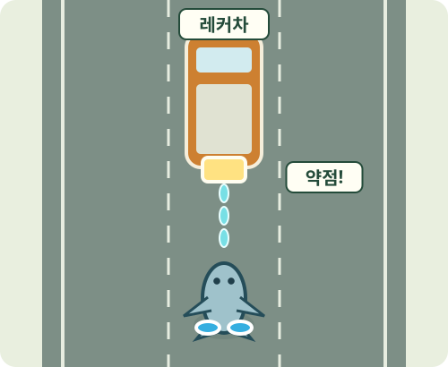

팔을 되돌리는 동안 공격할 수 있습니다.

**재미있는 점:** 처음에는 당했던 공격을 다음에는 읽고 이겨요.

**한 판의 흐름:** 레커 등장 → 타이어 피하기 → 추격·회복 선택 → 큰 팔 공격 → 마지막 대결

**갈림길의 한 가지 예**

- 왼쪽 · 가까이 추격하기: 적을 더 상대하고 코인을 얻어요.
- 오른쪽 · 회복하고 따라가기: 체력을 채워요. 다음 대결은 놓치지 않아요.

**실수하면:** 한 번 공격 기회를 놓쳐도 다음 기회가 와요. 회복 길을 골랐다고 보스를 놓치지는 않아요.

**재사용:** 레커차, 기사, 타이어와 요금소를 다시 쓸 수 있어요.

**새 작업:** 움직이는 레커 팔과 잠깐 열리는 약점이 필요해요.

[원래의 상세 기획](2026-09-26-highway-five-concepts-detailed.md)
