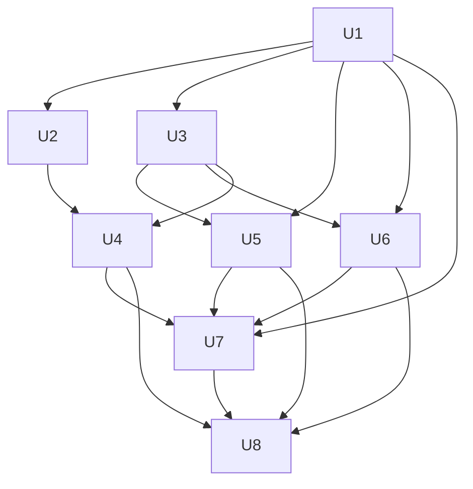

# Unify mobile presentation and reduce install size

## Summary

Apply the user's eleven phone-play findings, prioritizing a coherent, readable UI. Add the exact lateral upgrade, repair presentation defects, create original music/effects and a visible coin, reduce measured Android size, then verify the integrated result on the connected Samsung phone.

---

## Requirements

| ID | User request | Acceptance |
| --- | --- | --- |
| R1 | 좌우 이동 속도 늘리기 upgrade | +5% per level,10levels,+50% maximum; saved purchases affect actual lateral movement. |
| R2 | Substantially reduce the large installation | Report current699039439-byte APK, audit packed content, materially lower final APK size without removing chapters or shop items. |
| R3 | Natural knife hand on retreating enemies | Correct hand/grip through idle, retreat and attack clips; preserve gameplay roots and animation timing. |
| R4 | Current attack/health in upgrade UI | Clearly display live attack and maximum health, refreshed immediately after a purchase. |
| R5 | Visible model at top of mobile skin UI | Model renders on Android, selection and rotation work, repeated open/close cleans resources. |
| R6 | Compare several UI directions and unify all UI | Retain multiple real design candidates, choose one, apply it to lobby, upgrades, cosmetics, story/video, pause/settings, results and gameplay HUD. |
| R7 | Appropriate SE throughout the game | Cover combat, pickups, upgrades, UI, warnings, transitions, victory/defeat with bounded playback and volume control. |
| R8 | Two original BGM candidates inspired by supplied track | Create two new instrumental options, compare them and install the chosen loop; do not bundle the reference recording. |
| R9 | Use KERISKEDU_B SDF, alternatively GmarketSansTTFBold SDF2 | Prefer the available KERIS family consistently across static and dynamic labels; verify Korean and numeric glyphs. |
| R10 | UI is the highest priority | Judge native phone screens and interaction states, not only compilation or generated mockups. |
| R11 | Create more visible dropped coins | Distinct gold silhouette/emblem, readable at gameplay camera distance, unchanged one-shot monetary collection. |

The detailed source is the latest eleven-item user message. The YouTube reference is https://www.youtube.com/watch?v=jj3yM0bhHNw .

---

## Context and decisions

- The last installed APK is699039439bytes. BuildReport attributes approximately94MB to URP Lit,22MB to FlatKit,52MB to three large font assets,10MB to Jigmo source, and repeated multi-megabyte normal/emission textures and fitted meshes. Packed sizes are not identical to compressed APK contribution.
- KERISKEDU_B SDF and GmarketSansTTFBold SDF2 exist under Assets/JH/Font. Existing GameUIFont currently forces Jigmo.
- UpgradeStatManager currently has nine stable enum members and iterates ids1–9. Append the new type/id without renumbering saves; eliminate related nine-only assumptions in affected consumers and snapshots.
- CosmeticPreview currently uses a disabled Camera.Render path and an MSAA2 render texture. Android rendering behavior must be characterized before selecting the precise fix.
- Stable Audio3 is installed locally with optimized TFLite music/SFX support. Reuse that installation rather than inventing a remote service. Existing TRELLIS/Blender tooling is available if it materially improves the coin.
- The original Unity scene is currently dirty. Preserve its actual in-memory state before any authoring or scene switch; do not discard it or assume it is unchanged from the prior task.

### Assumptions selected for execution

- Compare three UI candidates, then choose one coherent cute arcade treatment using the requested font. Candidate count and exact palette are assistant decisions.
- Aim initially for at least50% APK reduction; this is a working optimization target, not a user-specified number or a promise before measurement.
- Price the new lateral utility upgrade using the existing coin upgrade economy and document the chosen curve. The +5%/10-level/+50% contract is fixed.
- Use original generated music/effects and project-owned UI visuals where possible; any external asset must retain verified licensing and source records.

---

## Implementation units

### U1. Preserve state and establish content/presentation baselines

**Requirements:** R2,R10. **Dependencies:** none.
**Files:** tools/audit-mobile-build-size.cs; docs/exec-plans/active/mobile-presentation-2026-09-14.md; task evidence under map-concepts/mobile-presentation-2026-09-14/.
**Approach:** Preserve dirty scene state, relevant source/assets/workbook and actual preference keys. Export the complete packed-asset inventory, material texture dependencies, font/glyph inventory and before screenshots.
**Verification:** Read-only reports are complete; backups contain the live scene and preserve its original path/state. Record current APK hash and phone baseline.
**Test expectation:** No unit test for report formatting; inspect real outputs and state preservation.

### U2. Lateral upgrade and current-stat display

**Requirements:** R1,R4. **Dependencies:** U1.
**Files:** Assets/ShooterSurvival/Scripts/Upgrade/UpgradeStatManager.cs; Assets/ShooterSurvival/Scripts/Upgrade/UpgradeTables.cs; Assets/ShooterSurvival/Scripts/Upgrade/UpgradeUI.cs; Assets/ShooterSurvival/Scripts/Player/PlayerScript.cs; Assets/ShooterSurvival/GameData/Editor/Data.xlsx; Assets/ShooterSurvival/Editor/ChapterPlaytestPreferences.cs; Assets/ShooterSurvival/Scripts/Analytics/UpgradeAnalyticsSnapshot.cs; Assets/Tests/Editor/LateralUpgradeTests.cs.
**Approach:** Append a stable lateral type/id and ten workbook rows. Apply one additive percent multiplier to lateral response, preserving lane bounds, forward speed, pause and stationary-combat locks. Add live attack/max-health summary to the shop.
**Patterns:** Existing upgrade ownership, amount/value-type parsing and signed workbook generation.
**Test scenarios:** Levels0/1/10 produce1/1.05/1.5 response; level11 cannot be bought; reload restores ownership; legacy ids remain unchanged; edge-of-lane clamping and holdout lock still work; purchase updates displayed stats without reopening; insufficient funds and repeat clicks cannot overcharge.
**Verification:** Native tests plus real purchase and drag response in an isolated preference scope.

### U3. Unified font and three UI candidates

**Requirements:** R6,R9,R10. **Dependencies:** U1.
**Files:** Assets/ShooterSurvival/Scripts/UI and VFX/GameUIFont.cs; Assets/ShooterSurvival/Editor/MobilePresentationBuilder.cs; Assets/ShooterSurvival/Resources/UI/; task design evidence; Assets/Tests/Editor/MobilePresentationTests.cs.
**Approach:** Compare native UI candidates using actual font, labels, controls and phone aspect ratio. Choose one palette, panel shape, icon grammar, spacing and button hierarchy. Use small reusable sprites/9-slice assets and explicit native text rather than large flattened screen images. Keep source licensing records.
**Test scenarios:** Required Korean/numeric glyphs resolve; all target scenes and runtime text factories select the chosen family; missing cosmetic selection, maximum upgrade, disabled purchase, loading/error and long-price states remain readable.
**Verification:** Retained candidate screenshots and chosen-theme evidence at Samsung1080×2340 plus another portrait aspect ratio.

### U4. Apply the selected UI and repair cosmetic preview

**Requirements:** R4,R5,R6,R9,R10. **Dependencies:** U2,U3.
**Files:** Assets/ShooterSurvival/Editor/MobilePresentationBuilder.cs; Assets/ShooterSurvival/Scripts/UI and VFX/ (CosmeticPreview, CosmeticShopUI, OpeningStoryUI, ChapterTransitionUI, CanvasScript, PlayerStatusHud and existing pause/settings/result classes); Assets/ShooterSurvival/Scripts/Harness/CombatHarness.cs; target scene instances; Assets/Tests/Editor/MobilePresentationTests.cs; Assets/Tests/Editor/CosmeticShopIntegrationTests.cs.
**Approach:** Preserve existing public actions and serialized button callbacks. Give cinematics restrained framing/captions/skip controls, shops consistent headers and clearly visible status. Use a supported URP render path and render-target lifecycle for the skin model. Hide developer keyboard chrome in ordinary mobile builds.
**Test scenarios:** Preview is nonempty on the actual phone; changing skin/shoes/hat and rotating updates it; repeated open/close and scene changes leave no stale camera/texture; movie play/skip/seek/natural completion still progress; pause and defeat actions remain reachable; safe areas and scrolling never hide critical controls.
**Verification:** Native screen captures including overlay UI and Android interaction checks.

### U5. Natural knife grip and visible coin

**Requirements:** R3,R11. **Dependencies:** U1,U3.
**Files:** existing knife enemy animation/prefab authoring paths discovered from the live models; Assets/ShooterSurvival/Editor/ForwardEnemyAnimatorSetup.cs or narrow pose authoring tool; Assets/ShooterSurvival/Scripts/Player/MoneyScript.cs; new coin mesh/prefab/materials; Assets/Tests/Editor/MobileCombatVisualTests.cs.
**Approach:** Correct local grip/pose on the actual retreating knife roles, preserving rig/socket/rest conventions. Create a compact, bright coin with a readable face/emblem and restrained glint; improve orientation/scale at the gameplay camera. Retain physical trigger and monetary ownership.
**Test scenarios:** Sample idle/retreat/attack/death poses; hand intersects the handle naturally and weapon remains attached; coin collection is once-only under trigger/proximity overlap, amounts remain exact, no projectile-blocking collider is introduced.
**Verification:** Before/after action views and phone-distance coin frames; native contact tests.

### U6. Original BGM and complete SFX coverage

**Requirements:** R7,R8. **Dependencies:** U1,U3.
**Files:** task audio generation scripts/candidates/provenance; Assets/ShooterSurvival/Resources/Audio/; Assets/ShooterSurvival/Scripts/Audio/GameAudioService.cs and event consumers; Assets/Tests/Editor/GameAudioTests.cs.
**Approach:** Generate two distinct original instrumental music candidates through the installed Stable Audio3 setup, choose and loop the stronger one. Generate/select appropriate sound effects, normalize and trim them, then wire an event coverage matrix. Use bounded reusable emitters, cooldown/priority rules and existing user volume settings. Avoid duplicate playback where legacy sources already handle an event.
**Test scenarios:** Every covered event resolves a clip; rapid fire remains bounded; pause/focus/scene transitions do not layer BGM copies; mute/volume persists; initialization and missing clip paths fail quietly; loop seam and decoded audio peaks/durations are checked.
**Verification:** Retain two playable BGM files, selected rationale, SFX event matrix and on-device mix checks.

### U7. Measured Android content reduction

**Requirements:** R2,R9. **Dependencies:** U1,U4,U5,U6.
**Files:** Assets/ShooterSurvival/Editor/MobileContentOptimizer.cs; scoped Android importer settings/materials/font references; approved pipeline settings or build-time stripping rules; Assets/Tests/Editor/MobileContentBudgetTests.cs.
**Approach:** First remove provably unused material texture references and redundant font dependencies, then tune Android texture/mesh/video/audio representation by role. Reduce shader variants only for verified unused rendering features with explicit guards. Preserve authored chapters, inventory and gameplay geometry. Keep originals available for rollback.
**Test scenarios:** An actual shader property is retained; stale material entries are removed safely; hero/UI fidelity budgets differ from scenery; gameplay road/collision meshes are excluded from lossy edits; imports and rebuilding are repeatable; all inventory items and movies still resolve.
**Verification:** Native before/after rendering and complete final APK byte comparison, not source-file-size estimates.

### U8. Integrated review, device build and handoff

**Requirements:** all. **Dependencies:** U2,U4,U5,U6,U7.
**Files:** tools/build-mobile-playtest.cs or fresh guarded successor; focused tests; architecture/reliability/quality docs; execution report and solution records.
**Approach:** Review every requested outcome, run appropriate native tests, restore user preference state, produce a fresh non-development APK and install in place on the authorized phone. Preserve signing configuration in memory and on disk using the verified guarded restore pattern.
**Test scenarios:** Ten-level lateral purchase/load flow, all menu transitions, preview after repeated opens, actual combat/coin/SFX, chapter transition/music, no developer overlay in normal Android, and signature-compatible update.
**Verification:** Source builds, native tests with nonzero counts, smaller signed APK, exact installed hash, real phone UI/play evidence and original preference/settings restoration.

---

## Sequencing and boundaries

Run work sequentially in the main thread per repository instructions; expensive generation jobs are bounded. No removal of chapters, unrelated progression redesign, production ad activation, phone data clearing, commits or publication are part of this work.

## Implementation-time questions and review

- Identify precise preview failure, knife-role assets and largest removable dependencies from actual data.
- Validate installed audio model paths and license terms; retain prompts/seeds/output provenance. The reference recording stays outside delivered assets.
- Validate dirty-scene backup before scene authoring, and include the new upgrade id in preference snapshots.
- Plan review uses coherence, feasibility, design, scope and persistence/security lenses sequentially. The integrated test matrix and representation/geometry boundary were added during that review; no user product decision blocks execution.

Execution progress belongs in docs/exec-plans/active/mobile-presentation-2026-09-14.md.
